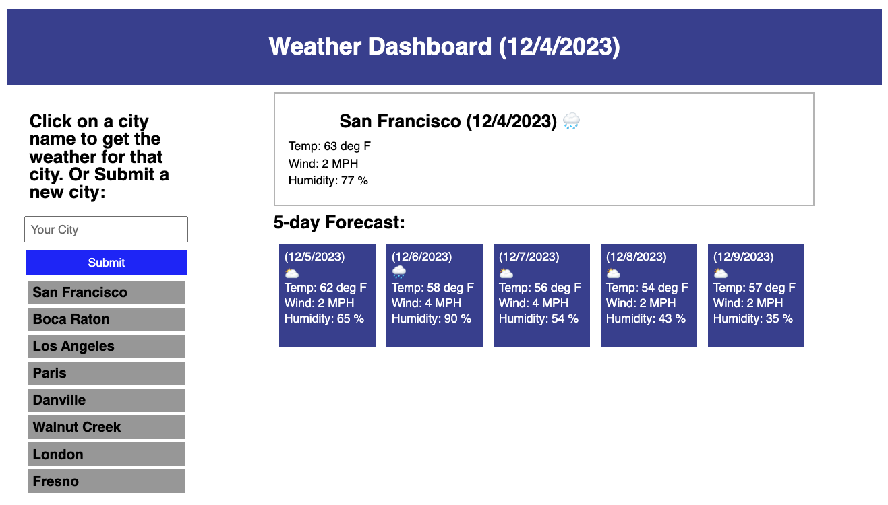

# weather-dashboard
A site to get the current weather, and a 5-day forecast, for the cities you are interested in
---

## Technology Used 

| Technology Used         | Resource URL           | 
| ------------- |:-------------:| 
| HTML    | [https://developer.mozilla.org/en-US/docs/Web/HTML](https://developer.mozilla.org/en-US/docs/Web/HTML) | 
| CSS     | [https://developer.mozilla.org/en-US/docs/Web/CSS](https://developer.mozilla.org/en-US/docs/Web/CSS)      |
| JavaScript     | [https://developer.mozilla.org/en-US/docs/Web/JavaScript](https://developer.mozilla.org/en-US/docs/Web/JavaScript)      |   
| Git | [https://git-scm.com/](https://git-scm.com/)     |    
| Day.js | [https://day.js.org/](https://day.js.org/)     |
| Open Weather API | [api.openweathermap.org](api.openweathermap.org)     |

---

## Description

[Visit the Deployed Site](https://jeffreydne.github.io/weather-dashboard)

This is a website where the user can access weather forecast information for a city of their choice. Once a city is chosen, the current weather and the 5-day forcast are presented to the user. That city's name is also stored in local storage and presented to the user for easy access for future searches. 

---

## Code Example

The below JavaScript example shows a fetch to the openweathermap API using a function which 1st fetches the data object, then returns the parsed response, then uses the returned data in a function. 

The function stores specific data in variables, including the chosen city name, current temp, current wind speed, current humidity, the longitude and latitude of the chosen city, and finally in the variable cityWeather, a description of the weather is stored to later be used to display the appropriate icon representing the current weather.

The currentWeatherFxn is then called with the appropriate variables used as arguments to display the current weather for the chosen city into the DOM.

```JS
 const getWeatherFxn = () => {
    fetch(weatherRequestUrl)
    .then(function (response) {
        return response.json();
    })
    .then(function (data) {
        let cityData = data.name;
        let cityTemp =data.main.temp;
        let cityWind = data.wind.speed;
        let cityHumid = data.main.humidity;
        let cityLon = data.coord.lon;
        let cityLat = data.coord.lat;
        let cityWeather = data.weather[0].main;
        //call currentWeatherFxn to load current weather data obtained from api into DOM
        currentWeatherFxn(cityData, cityTemp, cityWind, cityHumid, cityWeather);
 
```
The below Javascript example is a continuation of the above function. First the forecastUrl variable (previously declared) is changed to reflect the latitude and longitude of the chosen city (as required to get this information from the openweathermap API. City name cannot be used for the 5-day forecast). The apiKey is also stored in a variable and added to the url to prevent this private data from being seen if the user inspects the code in the browser. The parsed data is then used as the argument to the function which is called to insert the forecast weather into the DOM.

```JS
        forecastUrl = `https://api.openweathermap.org/data/2.5/forecast?lat=${cityLat}&lon=${cityLon}&appid=${apiKey}`;
        // using new forecastUrl fetch forecast data of chosen (or default) city. This is part of getWeatherFxn so that 5-day forecast is always of same city as current weather
        fetch(forecastUrl)
        .then(function (response) {
            return response.json();
        })
        .then(function (data) {
            forecastWeatherFxn(data.list);
        });
    });
}
```
## Usage

This webstie is designed to help a user easily find the current weather, as well as a 5-day forecast, in a city of their choosing. Once they have searched for weather in a city, that city's data will be cached and that city will be presented to the user in the future so they won't have to search again. 



---

## Learning Points

I developed this website from scratch based on a design that was presented as a screenshot provided by the UC Berkeley Extension Full Stack Bootcamp. 

* dayjs is used to get & format the current date as well as to format the dates provided by the API for the 5-day forecast.

* Data from the openweathermap.org API was obtained using the fetch(url) promise syntax. The response was parsed and returned using return response.json(). The data obtained is then used as an arguent in a function to get the raw data needed to dynamically add weather information to the DOM. 

* Event listeners are used to await input from the user regarding for which city they would like to see current and future weather.   

* Local Storage is used to store all city choices. The 10 most recent city choices (or all city choices if less than 10) are then presented as buttons which can be clicked on to retrieve the weather for that city again without having to type it in again. 

* Event delegation is used to allow the use of a single event listener to listen for a click on any of the previously searched cities. Event.target.innerText is then used to get the data from the specific button clicked on. 

---

## Author Info

### Jeffrey Nelson


* [Portfolio](https://jeffreydne.github.io/Jeff-Nelson-Portfolio/)
* [LinkedIn](https://www.linkedin.com/in/jeffrey-nelson13/)
* [Github](https://github.com/Jeffreydne)

---
## Credits
 The excellent staff at UC Berkeley Extension Full Stack Bootcamp provided the beginings of the table of technology used in this README.md. The basic design and layout of the Weather Dashboard is based on a screenshot provided by UC Berkeley Extension. 
 
 I wrote all the HTML, CSS and JS to implement the site.

 To store data using localStorage, I borrowed heavily from the web storage tutorial at freeCodeCamp.org, modifying as needed. 
 
 I used instructions from openweathermap.org to use their API, and all weather data presented to the user is from this API.